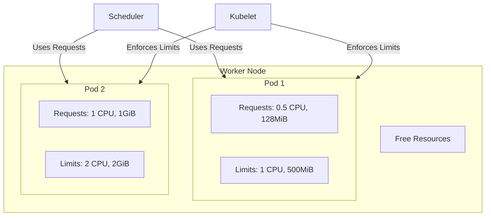

#DevOps #Containerization #Kubernetes #CoreConcept #ResourceManagement #Requests #Limits #Scheduling #QoS

>  **Requests** and **Limits** are the mechanisms Kubernetes uses to manage CPU and memory resources for containers.
> - **Requests:** The *minimum* amount of resources a container is guaranteed to get. This value is used by the **Scheduler** to find a node with enough available capacity to place the Pod.
> - **Limits:** The *maximum* amount of resources a container is allowed to use. This value is enforced by the **Kubelet** to prevent a single container from starving other containers on the same node.

---

## ❓ Why Manage Resources?

By default, a container running in a [[The Kubernetes Pod|Pod]] can consume as much CPU and memory as is available on the worker node. This can lead to problems:
-   **Noisy Neighbor Problem:** A single, poorly-behaved container could consume all the resources on a node, causing other critical applications on the same node to slow down or crash.
-   **Inefficient Scheduling:** Without knowing how many resources a pod needs, the Kubernetes scheduler might place a large, resource-intensive pod on a node that doesn't have enough capacity, leading to resource contention and instability.

By specifying resource `requests` and `limits`, you provide critical information to Kubernetes, allowing it to make intelligent scheduling decisions and enforce fair resource allocation.

---

## 🏛️ The Core Concepts: Requests vs. Limits

### 1. `requests` (Guaranteed Resources)
-   **What it is:** The amount of CPU and memory that Kubernetes **guarantees** to allocate to the container.
-   **Who uses it:** The **`kube-scheduler`**. When a new Pod needs to be scheduled, the scheduler scans the worker nodes and will only place the Pod on a node that has at least the `requested` amount of CPU and memory available.
-   **In short:** A `request` is a reservation. It tells the scheduler, "This Pod needs *at least* this much to run properly."

### 2. `limits` (Maximum Consumption)
-   **What it is:** The absolute maximum amount of CPU and memory that a container is **allowed** to consume.
-   **Who uses it:** The **`kubelet`** (the agent running on each worker node). The `kubelet` constantly monitors the resource usage of the containers on its node.
    -   **CPU:** If a container tries to use more CPU than its `limit`, it will be **throttled**, meaning its CPU usage will be artificially capped.
    -   **Memory:** If a container tries to use more memory than its `limit`, it will be terminated and restarted by the `kubelet` with an **"Out of Memory" (OOMKilled)** error.
-   **In short:** A `limit` is a hard ceiling. It tells the `kubelet`, "Never let this container use more than this amount of resources."

---

## 🏗️ Visualizing Resource Allocation

Imagine a Kubernetes worker node with 8 vCores of CPU and 32 GB of memory.


-   The **Scheduler** looks at the `requests` (500m + 1000m = 1.5 CPU cores) and decides this node has enough capacity.
-   The **Kubelet** ensures Container 1 never uses more than 1 CPU core and Container 2 never uses more than 2 CPU cores.
-   A container is allowed to "burst" above its `request` up to its `limit`, if there are free resources on the node.

---

## ✍️ How to Define Resources in a Manifest

Resource requests and limits are defined within the `spec` of a container, inside the `resources` block.

### Example `Deployment` Manifest
```yaml
apiVersion: apps/v1
kind: Deployment
metadata:
  name: app1-nginx-deployment
spec:
  replicas: 1
  template:
    spec:
      containers:
      - name: app1-nginx
        image: nginx
        # The 'resources' block is defined at the container level
        resources:
          # 'requests' block defines the guaranteed resources
          requests:
            cpu: "100m"      # 100 millicores (10% of a CPU core)
            memory: "128Mi"  # 128 Mebibytes
          # 'limits' block defines the maximum allowed resources
          limits:
            cpu: "250m"      # 250 millicores (25% of a CPU core)
            memory: "256Mi"  # 256 Mebibytes
```
-   **CPU Units:**
    -   `m` stands for "millicores". `1000m` is equal to `1` full CPU core. `100m` is 10% of a core.
-   **Memory Units:**
    -   `Mi` stands for "Mebibyte". This is the standard unit for memory in Kubernetes. `Ki` (Kibibyte), `Gi` (Gibibyte), etc., are also used.

---

> [!summary]
> In the next lecture, we will:
> 1.  Take an existing `Deployment` manifest.
> 2.  Add a `resources` block with `requests` and `limits` for CPU and memory.
> 3.  Deploy the manifest and use `kubectl describe pod` to verify that the resource settings have been applied.
> 4.  Discuss the different Quality of Service (QoS) classes that Kubernetes assigns to Pods based on how their requests and limits are configured.