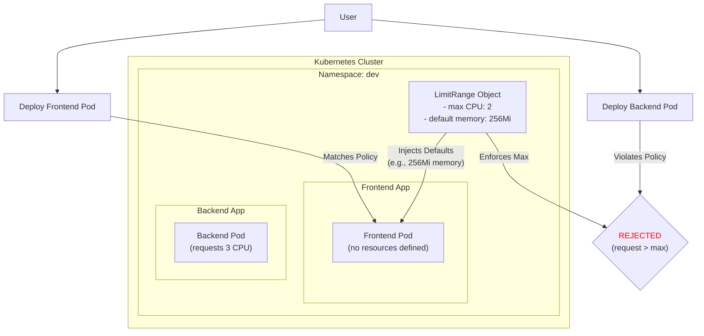

#DevOps #Containerization #Kubernetes #CoreConcept #Namespaces #ResourceManagement #LimitRange #ResourceQuota #Admin

>  A **`LimitRange`** is a policy object that provides constraints on resource consumption for individual **Pods or Containers** within a [[Kubernetes Namespaces Virtual Clusters|Namespace]]. It is used to enforce minimums, maximums, and default values for CPU and memory, preventing any single Pod from monopolizing resources and ensuring a baseline level of resource allocation even if developers don't specify them.

---

When managing a multi-tenant Kubernetes cluster, two important concepts for resource control are `LimitRange` and `ResourceQuota`.

## 🏛️ `ResourceQuota` vs. `LimitRange`: A Tale of Two Scopes

It's crucial to understand the difference between these two objects.

-   **`ResourceQuota`:**
    -   **Scope:** The entire **Namespace**.
    -   **Purpose:** Sets a limit on the **total aggregate resource consumption** for all objects within a namespace. For example, you can say, "The `dev` namespace as a whole cannot use more than 20 CPU cores and 64Gi of memory."
    -   **Analogy:** The total power budget for a whole apartment building.

-   **`LimitRange`:**
    -   **Scope:** Individual **Pods and Containers** within a Namespace.
    -   **Purpose:** Sets constraints on *individual* objects. For example, "No single container in the `dev` namespace can request more than 2 CPU cores."
    -   **Analogy:** The circuit breaker for a single apartment within the building.

> [!danger] The Problem `LimitRange` Solves
> A `ResourceQuota` alone is not enough. Imagine you give the `dev` namespace a quota of 20 CPUs. A single, misconfigured Pod could be deployed that tries to use all 20 CPUs, effectively starving every other application in that namespace. A `LimitRange` prevents this by setting per-container guardrails.

---

## ✨ Key Features of a `LimitRange`

A `LimitRange` is a powerful policy tool that can:

1.  **Enforce Minimum and Maximum Compute Resources:** Set `min` and `max` values for CPU and memory that any Pod or Container in the namespace can request or be limited to.
2.  **Enforce Minimum and Maximum Storage Requests:** Set `min` and `max` values for storage that a `PersistentVolumeClaim` (PVC) can request.
3.  **Enforce a Ratio between Requests and Limits:** For example, you can enforce a policy that a container's memory `limit` can be no more than twice its `request`.
4.  **Set Default Requests and Limits:** This is a key feature. If a developer deploys a Pod *without* specifying any [[Kubernetes Resource Management Requests and Limits|resource requests or limits]], the `LimitRange` will **automatically inject** default values into the container's specification at runtime.

### Visualizing `LimitRange` in Action

-   The Frontend Pod is deployed without any resource specs, so the `LimitRange` automatically injects the default memory request.
-   The Backend Pod is rejected by the API server because its request for 3 CPUs exceeds the `max` of 2 CPUs defined in the `LimitRange`.

---

## ✍️ The `LimitRange` Manifest

Let's look at a high-level example of a `LimitRange` manifest.

```yaml
# API Version for LimitRange is 'v1'
apiVersion: v1
# The kind of object is 'LimitRange'
kind: LimitRange
metadata:
  name: cpu-memory-defaults
  # A LimitRange is a namespaced object
  namespace: dev3
spec:
  # 'limits' is a list of constraints
  limits:
  # This constraint applies to objects of type 'Container'
  - type: Container
    
    # Sets the maximum CPU/memory any container in the namespace can have
    max:
      cpu: "1" # 1 vCPU
      memory: "1Gi"
      
    # Sets the minimum CPU/memory any container in the namespace must have
    min:
      cpu: "100m" # 100 millicores
      memory: "64Mi"
      
    # If a container is created WITHOUT limits, these values are automatically applied.
    default:
      cpu: "500m" # 0.5 vCPU
      memory: "512Mi"
      
    # If a container is created WITHOUT requests, these values are automatically applied.
    defaultRequest:
      cpu: "300m"
      memory: "256Mi"
      
    # Enforces that the memory limit/request ratio cannot exceed a certain value.
    maxLimitRequestRatio:
      memory: 2
```

### Understanding the `spec.limits`
-   **`default` (for Limits):** If a developer creates a container and specifies a `request` but **not** a `limit`, this `default` value will be injected as the container's `limit`.
-   **`defaultRequest` (for Requests):** If a developer creates a container and specifies a `limit` but **not** a `request`, this `defaultRequest` value will be injected as the container's `request`.
-   **Important Interaction:** If a container is created with **neither** a request nor a limit, the `default` value is used for its `limit`, and the `defaultRequest` value is used for its `request`.

---

> [!summary]
> In the next lecture, we will:
> 1.  Create a new namespace, `dev3`.
> 2.  Create and apply the `LimitRange` manifest to this namespace.
> 3.  Deploy a Pod *without* any resource specifications.
> 4.  Use `kubectl describe pod` to observe that the default requests and limits from the `LimitRange` have been **automatically injected** into the running pod's specification.
> 5.  Attempt to deploy a Pod that violates the `max` constraints and observe that it is rejected by the Kubernetes API server.