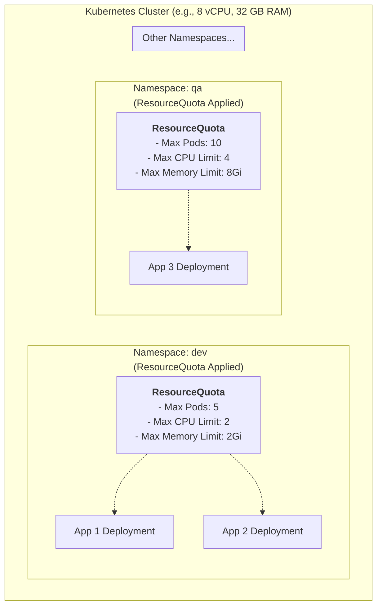

#DevOps #Containerization #Kubernetes #CoreConcept #Namespaces #ResourceManagement #ResourceQuota #Admin

>  A **`ResourceQuota`** is a powerful administrative tool in Kubernetes that provides constraints to limit the **aggregate resource consumption per [[Kubernetes Namespaces Virtual Clusters|namespace]]**. It allows cluster administrators to control how many objects of a certain type can be created in a namespace (e.g., max 10 pods) and the total amount of compute resources (CPU and memory) that can be consumed by all objects within that namespace.

---

## 😫 The Problem: The "Unfair Share" in a Multi-Tenant Cluster

When several users or teams share a Kubernetes cluster with a fixed number of nodes, a major concern arises: one team could inadvertently (or intentionally) consume more than its fair share of resources. A single, resource-hungry application could starve all other applications in the cluster, impacting their performance and stability.

## ✨ The Solution: `ResourceQuota`

`ResourceQuota` is the tool for cluster administrators to address this concern. It operates at the namespace level, providing a hard cap on resource usage.

### What Can a `ResourceQuota` Limit?
A `ResourceQuota` object can enforce limits on two main categories:

1.  **Object Count:** It can limit the **quantity** of objects that can be created in a namespace by their `kind`.
    -   `pods`: The total number of Pods that can exist in the namespace.
    -   `services`: The total number of Services.
    -   `persistentvolumeclaims` (PVCs): The total number of PVCs.
    -   `configmaps`, `secrets`, etc.

2.  **Compute Resource Consumption:** It can limit the **total amount of compute resources** that may be requested or limited by all Pods in that namespace.
    -   `requests.cpu`: The sum of all CPU `requests` of all Pods in the namespace cannot exceed this value.
    -   `limits.cpu`: The sum of all CPU `limits` of all Pods in the namespace cannot exceed this value.
    -   `requests.memory`: The sum of all memory `requests`.
    -   `limits.memory`: The sum of all memory `limits`.

### The Visual Architecture


In this example, the `dev` namespace is restricted to using a maximum of 5 pods and 2 CPU cores in total, ensuring it cannot impact the resources allocated to the `qa` namespace.

---

## ✍️ The `ResourceQuota` Manifest

Let's review the manifest that defines these constraints.

```yaml
apiVersion: v1
kind: ResourceQuota
metadata:
  name: dev3-resource-quota
  # A ResourceQuota is a namespaced object. It applies to the namespace specified here.
  namespace: dev3
spec:
  # The 'hard' block defines the absolute limits.
  hard:
    # --- Compute Resource Quotas ---
    # The sum of all CPU requests from all pods in 'dev3' cannot exceed 1 vCPU.
    requests.cpu: "1" 
    # The sum of all CPU limits from all pods in 'dev3' cannot exceed 2 vCPUs.
    limits.cpu: "2"
    # The sum of all memory requests cannot exceed 1 GiB.
    requests.memory: 1Gi
    # The sum of all memory limits cannot exceed 2 GiB.
    limits.memory: 2Gi
    
    # --- Object Count Quotas ---
    # Maximum number of Pods that can exist in the 'dev3' namespace.
    pods: "5"
    # Maximum number of ConfigMaps.
    configmaps: "5"
    # Maximum number of PersistentVolumeClaims.
    persistentvolumeclaims: "5"
    # Maximum number of Secrets.
    secrets: "5"
    # Maximum number of Services.
    services: "5"
```

---

> [!summary]
> `ResourceQuota` is a critical tool for cluster administrators to enforce fairness and stability in a multi-tenant environment. By applying quotas to namespaces, you can guarantee that no single team or application can monopolize cluster resources.
>
> It is often used in conjunction with another namespace-level object, **`LimitRange`**, which sets *default* resource requests and limits for Pods that don't define their own. We will explore this in a future lecture.
>
> In the next hands-on lecture, we will:
> 1.  Create a new namespace.
> 2.  Apply this `ResourceQuota` manifest to it.
> 3.  Attempt to deploy applications that violate these quotas to observe how Kubernetes enforces the limits.