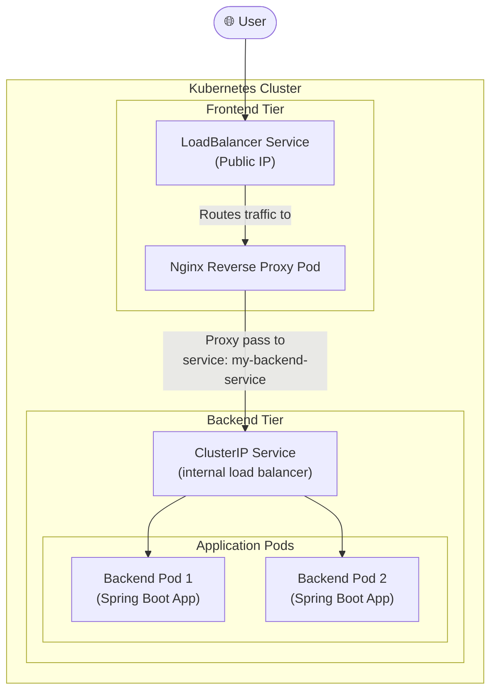

#DevOps #Containerization #Kubernetes #CoreConcept #YAML #Deployments #Services #ClusterIP #LoadBalancer #Manifests #HandsOn #Tutorial

>  This is a comprehensive, hands-on guide to deploying a full multi-tier application on Kubernetes using the declarative, **YAML-first** approach. We will create four separate manifest files to define a **backend [[The Kubernetes Deployment|Deployment]]**, a **backend `ClusterIP` [[Kubernetes Services A Deep Dive|Service]]**, a **frontend Deployment**, and a **frontend `LoadBalancer` Service**, and then deploy them all to the cluster.

This demo recreates the same architecture we built imperatively in a previous lecture, but this time using the standard, version-controllable, and repeatable "Infrastructure as Code" method.

---

## 🏛️ The Application Architecture

Our goal is to build a two-tier application:
1.  A **backend** Spring Boot REST API.
2.  A **frontend** Nginx reverse proxy that communicates with the backend.



---

## ✍️ Step 1: Writing the Backend Manifests from Scratch

We will create two files: one for the backend Deployment and one for its `ClusterIP` Service.

### `01-backend-deployment.yaml`
This file defines the desired state for our backend application pods.
```yaml
apiVersion: apps/v1
kind: Deployment
metadata:
  name: backend-rest-app
  # Optional labels for the Deployment object itself
  labels:
    app: backend-rest-app
    tier: backend
spec:
  replicas: 2 # We want two instances of our backend
  selector:
    matchLabels:
      app: backend-rest-app
  template:
    metadata:
      # These labels will be applied to the Pods
      labels:
        app: backend-rest-app
        tier: backend
    spec:
      containers:
      - name: backend-rest-app-container
        image: stacksimplify/kube-helloworld:1.0.0
        ports:
        - containerPort: 8080 # The Spring Boot app listens on port 8080
```
-   **Debugging Note:** The instructor demonstrates a common YAML indentation error. `spec` must be at the same indentation level as `metadata` *within the pod template*. Careful alignment is critical.

### `02-backend-clusterip-service.yaml`
This file creates the internal service that the frontend will use to communicate with the backend.
```yaml
apiVersion: v1
kind: Service
metadata:
  # This name is CRITICAL. The frontend Nginx container is hardcoded
  # to proxy requests to this exact DNS name.
  name: my-backend-service
spec:
  # 'type' is optional. If omitted, it defaults to ClusterIP.
  # type: ClusterIP
  
  # This selector tells the Service to find all Pods with the label 'app: backend-rest-app'
  selector:
    app: backend-rest-app
    
  ports:
  - name: http
    port: 8080 # The Service will listen on port 8080
    targetPort: 8080 # Traffic will be forwarded to port 8080 on the Pods
```

---

## ✍️ Step 2: Writing the Frontend Manifests from Scratch

Next, we'll create the manifests for the frontend Nginx proxy.

### `03-frontend-deployment.yaml`
This is very similar to the backend deployment, but uses the Nginx reverse proxy image.
```yaml
apiVersion: apps/v1
kind: Deployment
metadata:
  name: frontend-nginx-app
  labels:
    app: frontend-nginx-app
    tier: frontend
spec:
  replicas: 1
  selector:
    matchLabels:
      app: frontend-nginx-app
  template:
    metadata:
      labels:
        app: frontend-nginx-app
        tier: frontend
    spec:
      containers:
      - name: frontend-nginx-app-container
        image: stacksimplify/kube-frontend-nginx:1.0.0
        ports:
        - containerPort: 80 # The Nginx server listens on port 80
```

### `04-frontend-loadbalancer-service.yaml`
This service will expose our frontend to the public internet.
```yaml
apiVersion: v1
kind: Service
metadata:
  name: frontend-nginx-app-loadbalancer-service
spec:
  type: LoadBalancer # This type requests a public IP from the cloud provider
  
  selector:
    app: frontend-nginx-app # Selects the frontend Pods
    
  ports:
  - name: http
    port: 80 # The external Load Balancer will listen on port 80
    targetPort: 80 # Forward traffic to port 80 on the Nginx Pods
```

---

## 🛠️ Hands-On: Deploying the Full Application

### Step 1: Deploy the Backend
1.  Navigate to the directory containing the manifest files (`kube-manifests/`).
2.  Apply both backend files. You can specify multiple files in a single `apply` command.
    ```bash
    kubectl apply -f 01-backend-deployment.yaml -f 02-backend-clusterip-service.yaml
    ```
3.  **Verify:**
    ```bash
    # Check that the backend pods are running
    kubectl get pods
    
    # Check that the ClusterIP service was created (it will have NO external IP)
    kubectl get svc
    ```

### Step 2: Deploy the Frontend
1.  Apply both frontend files:
    ```bash
    kubectl apply -f 03-frontend-deployment.yaml -f 04-frontend-loadbalancer-service.yaml
    ```
2.  **Verify:**
    ```bash
    # Check that both frontend and backend pods are running
    kubectl get pods
    
    # Check the services. The frontend service will initially be in a <pending> state.
    kubectl get svc
    ```
    Wait a minute or two and run `kubectl get svc` again. An `EXTERNAL-IP` will be assigned to the `frontend-nginx-app-loadbalancer-service`.

### Step 3: Access and Test the Application
1.  Copy the `EXTERNAL-IP` of the frontend service.
2.  Navigate to `http://<EXTERNAL-IP>/hello` in your browser.
3.  You should see the "Hello World V1" response from the backend, served through the frontend proxy.
4.  If you refresh multiple times, you may see the unique ID of the backend Pod change in the response, demonstrating that the `ClusterIP` service is load balancing requests from the frontend to the multiple backend replicas.

---

## 🚀 Efficiently Managing Manifests

Instead of applying files one by one, you can apply all manifest files within a directory.

### Applying an Entire Directory
1.  Navigate to the parent directory of your `kube-manifests` folder.
2.  Run the `apply` command on the folder itself:
    ```bash
    kubectl apply -f kube-manifests/
    ```
    Kubernetes will process every `.yaml` file in that directory. If the resources already exist, it will update them ("configured"); if they don't, it will create them.

### Deleting an Entire Directory's Resources
Similarly, you can delete all the resources defined in a directory's manifests with a single command. This is the standard way to clean up after a demo.
```bash
kubectl delete -f kube-manifests/
```
This will delete the backend deployment, backend service, frontend deployment, and frontend service, and the cloud provider will automatically de-provision the public IP.

---

> [!summary] Conclusion
> This exercise demonstrates the power and standard practice of the **declarative approach** in Kubernetes. By defining our entire multi-tier application as a set of version-controllable YAML files, we create a system that is repeatable, auditable, and easy to manage at scale. This is the foundation of GitOps and modern cloud-native application management.