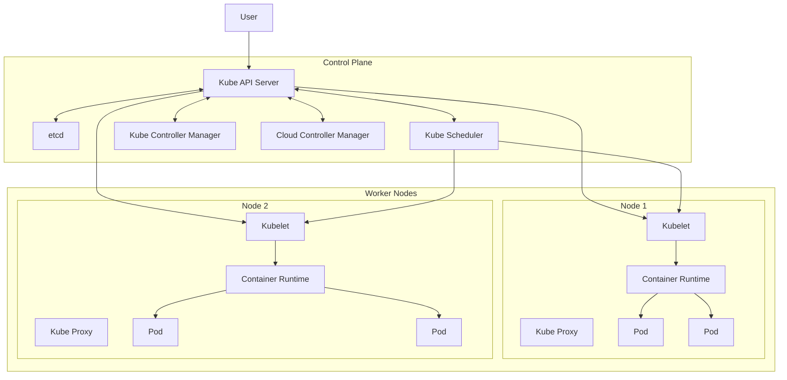

#DevOps #Containerization #Kubernetes #Architecture #CoreConcept #Pods #Deployments #Services

>  Kubernetes (K8s) is a portable, extensible, open-source platform for managing and orchestrating containerized workloads and services. It automates application deployment, scaling, and management. Its architecture consists of a **Control Plane (Master Nodes)** that manages the cluster and **Worker Nodes** that run the actual application containers.

---

## ❓ Why Kubernetes?

Kubernetes provides a powerful, declarative framework for running distributed systems resiliently. It comes with a rich set of features out of the box that are essential for modern applications:

-   **Service Discovery and Load Balancing:** Automatically exposes containers to the internet or other containers and distributes network traffic.
-   **Storage Orchestration:** Automatically mounts and manages storage systems, whether local or from a cloud provider.
-   **Automated Rollouts and Rollbacks:** Lets you describe the desired state for your deployed containers and can automatically change the actual state to the desired state at a controlled rate, with the ability to roll back if something goes wrong.
-   **Automatic Bin Packing:** Automatically places containers onto nodes based on their resource requirements and other constraints, making efficient use of your infrastructure.
-   **Self-Healing:** Automatically restarts containers that fail, replaces and reschedules containers when nodes die, and kills containers that don't respond to user-defined health checks.
-   **Secrets and Configuration Management:** Lets you store and manage sensitive information, such as passwords and SSH keys, and application configuration without rebuilding your container images.

---

## 🏛️ Kubernetes Architecture: Control Plane and Worker Nodes

A Kubernetes cluster consists of a set of worker machines, called **nodes**, that run containerized applications. Every cluster has at least one worker node. The worker node(s) host the **Pods** which are the components of the application workload. The **Control Plane** manages the worker nodes and the Pods in the cluster.



### The Control Plane (Master Node Components)
The control plane is the brain of the cluster. It makes global decisions about the cluster (e.g., scheduling) and detects and responds to cluster events.

-   **`kube-api-server`:** The front-end for the Kubernetes control plane. It exposes the Kubernetes API. This is the central point of communication; all other components, including `kubectl` and the worker nodes, talk to the API server.
-   **`etcd`:** A consistent and highly-available key-value store used as Kubernetes' backing store for all cluster data. It stores the entire state of the cluster, including node information, pod definitions, and current states.
-   **`kube-scheduler`:** Watches for newly created Pods that have no assigned node and selects a healthy worker node for them to run on based on resource availability, constraints, and other policies.
-   **`kube-controller-manager`:** Runs multiple controller processes in the background that are responsible for maintaining the desired state of the cluster. Key controllers include:
    -   **Node Controller:** Responsible for noticing and responding when nodes go down.
    -   **Replication Controller:** Responsible for maintaining the correct number of pods for every replication controller object.
    -   **Endpoints Controller:** Populates the Endpoints object, which joins Services and Pods.
    -   **Service Account & Token Controllers:** Create default accounts and API access tokens for new namespaces.
-   **`cloud-controller-manager`:** (Only in cloud environments) This component embeds cloud-specific control logic. It allows the cluster to interact with the underlying cloud provider's API to manage resources like load balancers and storage volumes. Key cloud controllers include:
    -   **Node Controller:** For checking if a node has been deleted in the cloud after it stops responding.
    -   **Route Controller:** For setting up routes in the underlying cloud infrastructure.
    -   **Service Controller:** For creating, updating, and deleting cloud provider load balancers.

### The Worker Node Components
Worker nodes are the machines (VMs or physical servers) where your applications actually run.

-   **`container runtime`:** The underlying software that is responsible for running containers. Kubernetes supports several container runtimes: [[Docker]], `containerd`, CRI-O, etc.
-   **`kubelet`:** **The most important agent on a worker node.** It runs on every node in the cluster. It communicates with the master's API server and ensures that the containers described in PodSpecs are running and healthy on its node.
-   **`kube-proxy`:** A network proxy that runs on each node in the cluster. It maintains network rules on nodes and handles network communication to your Pods from network sessions inside or outside of your cluster. It is what enables the Kubernetes Service concept.

---

## 🧱 Fundamental Kubernetes Core Concepts

These are the essential building blocks you will work with when deploying applications on Kubernetes.

-   **Pod:**
    -   **The smallest and simplest deployable object in Kubernetes.**
    -   Represents a **single instance of a running process** in your cluster.
    -   A Pod encapsulates one or more application containers, storage resources, a unique network IP, and options that govern how the container(s) should run.

-   **ReplicaSet:**
    -   Its purpose is to **maintain a stable set of replica Pods running at any given time**.
    -   You define a template for your Pod and the number of replicas you want. The ReplicaSet controller will then work to ensure that number of pods matching the template always exists.
    -   You typically do not manage ReplicaSets directly.

-   **Deployment:**
    -   **The standard and recommended way to manage stateless applications.**
    -   A Deployment is a higher-level object that manages ReplicaSets for you.
    -   It runs multiple replicas of your application and **automatically replaces any instances that fail or become unresponsive**.
    -   Its key features are managing **rollouts** (updating your application to a new version) and **rollbacks** (reverting to a previous version) in a controlled manner.

-   **Service:**
    -   An abstraction which defines a logical set of Pods and a policy by which to access them.
    -   **Services provide a stable, virtual IP address** that fronts a group of Pods.
    -   Since Pods are ephemeral (they can be created and destroyed, and their IPs change), a Service provides a reliable endpoint.
    -   In simple terms, a **Service sits in front of one or more Pods and acts as a load balancer.**

---

## ⚙️ Two Approaches to Managing Kubernetes Objects

You can create and manage Kubernetes resources in two primary ways:

### 1. Imperative Approach (Using `kubectl` Commands)
-   **What it is:** You use direct commands like `kubectl run` or `kubectl create` to tell Kubernetes what to do.
-   **Example:**
    ```bash
    # Create a Deployment named 'nginx-deployment' with 2 replicas using the 'nginx' image
    kubectl create deployment nginx-deployment --image=nginx --replicas=2
    ```
-   **Pros:** Quick for simple, one-off tasks and for learning.
-   **Cons:** Not easily repeatable, not version-controlled, and hard to manage complex applications.

### 2. Declarative Approach (Using YAML Manifests)
-   **What it is:** This is the **standard and recommended** approach. You define the *desired state* of your application in YAML files called **manifests**. You then use `kubectl apply` to tell Kubernetes to make the cluster's state match what's in the file.
-   **Example (`deployment.yaml`):**
    ```yaml
    apiVersion: apps/v1
    kind: Deployment
    metadata:
      name: nginx-deployment
    spec:
      replicas: 2
      template:
        spec:
          containers:
          - name: nginx
            image: nginx
    ```
    ```bash
    kubectl apply -f deployment.yaml
    ```
-   **Pros:**
    -   **Infrastructure as Code:** Your configuration is version-controlled in Git.
    -   **Repeatable and Auditable:** You can easily recreate or roll back your application's state.
    -   **Manages Complexity:** It's the only scalable way to manage real-world applications.

> [!info] Both approaches will be used throughout the course to master these concepts, including live template writing for YAML manifests.