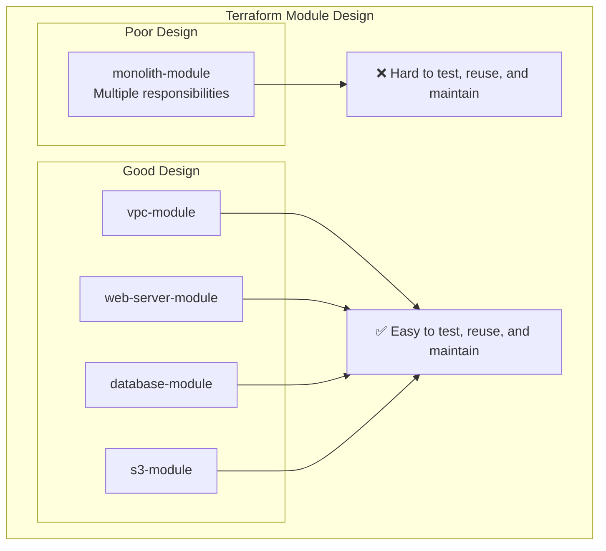

#DevOps #IaC #Terraform #CoreConcept #SoftwareArchitecture #Modules

>  **Cohesion** is a software design principle that states a component should have a single, well-defined responsibility. A highly cohesive Terraform module groups related resources together to perform one specific task (e.g., setting up a network), making it easier to understand, maintain, and reuse.

---

## ❓ What is Cohesion?

In software design, cohesion is about focusing a module or component on a specific task or responsibility. A component with **high cohesion** has a narrow, well-defined purpose. A component with **low cohesion** is a "junk drawer" that does many unrelated things.

> [!success] The Benefits of High Cohesion
> A cohesive software component is:
> -   **Easier to maintain:** Changes are localized to one place.
> -   **Easier to understand:** Its purpose is immediately obvious.
> -   **Easier to extend:** You can add functionality related to its core purpose without side effects.

This principle is critically important when building and designing Infrastructure as Code.

---

## 🍳 The Kitchen Analogy for Cohesion

The principles of cohesion can be seen in any well-organized kitchen. The components of the kitchen are organized into cohesive modules to make the cook's life easier.

### Cohesive Components of a Kitchen
-   **The Plate Cupboard:** Contains all the bowls and plates.
-   **The Spice Rack:** Contains all the spices and seasonings.
-   **The Cutlery Drawer:** Contains all the utensils (forks, knives, spoons).
-   **The Refrigerator:** Contains all the food that needs to be kept cold.

A well-regulated kitchen is highly cohesive. The chef always knows exactly where to go to find a certain type of component for a certain function.

### Optimizing for Use Cases (Proximity Matters)
The placement of these cohesive components is often strategic to optimize for common tasks.

-   **Use Case 1: Making Breakfast**
    -   You need a bowl, a spoon, milk, and maybe a placemat.
    -   An organized kitchen will likely have the bowl cupboard, the cutlery drawer, and the placemat drawer all in close proximity to the refrigerator to make this daily task fast and efficient.

-   **Use Case 2: Cooking on the Stovetop**
    -   You need a frying pan, oil, and seasonings.
    -   A well-designed kitchen will place the pots-and-pans drawer and the spice/oil cupboard very close to the cooktop to facilitate this use case.

> [!tip]
> Just like in a kitchen, cohesion in your code makes your life easier. In software, and especially in Infrastructure as Code, the same principles apply.

---

## 🚀 How Cohesion Applies to Terraform

In Terraform, the goal is to create highly cohesive [[Encapsulation in Terraform|modules]]. A cohesive module has a single responsibility.

### The "Junk Drawer" Anti-Pattern (Low Cohesion)
Imagine a single, massive Terraform module that tries to do everything:
-   Creates the VPC, subnets, and route tables.
-   Provisions EC2 instances for the web servers.
-   Sets up an RDS database.
-   Configures S3 buckets for storage.
-   Creates IAM roles and policies.

This module has **low cohesion**. It's hard to understand, difficult to maintain, and impossible to reuse any individual part.

### The Cohesive Approach (High Cohesion)
A better approach is to break the infrastructure down into smaller, focused, highly cohesive modules, each with a single responsibility.

-   A `vpc` module responsible only for networking.
-   A `web-server` module responsible only for provisioning compute instances.
-   A `database` module responsible only for setting up the RDS instance.
-   An `s3-bucket` module responsible only for creating and configuring a bucket.

By structuring your infrastructure this way, you create a "well-regulated kitchen." When you need to adjust your networking, you know to go directly to the `vpc` module. If you need to scale your web servers, you only need to touch the `web-server` module. This makes your infrastructure code far easier to manage and reason about.