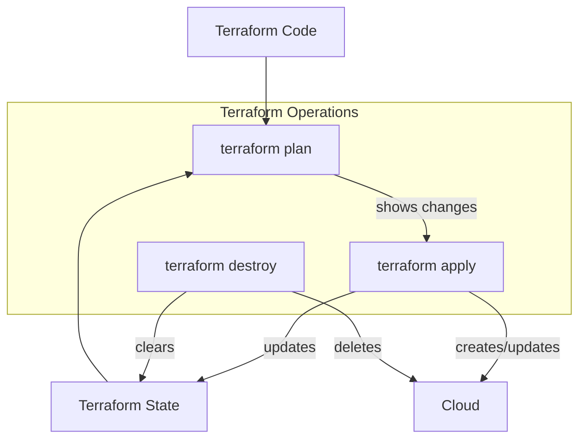

#DevOps #IaC #Terraform #CoreConcept #HandsOn #Tutorial

>  This is a hands-on guide to creating your first Terraform project. You will learn to declare a `resource`, master the core workflow (`init`, `plan`, `apply`, `destroy`), understand the relationship between your **code**, the **state file**, and the **environment**, and learn how to parameterize your configuration using **input variables**.

---

## 🛠️ Part 1: Setting Up Your First Project

Let's start by creating a simple Terraform project from scratch.

1.  **Create Your Project Folder:**
    -   In your source code directory, create a new folder structure: `Terraform-101/lab-01`.

2.  **Open in VS Code:**
    -   Navigate into the `lab-01` folder.
    -   Right-click inside the folder and select "Open with Code".
    > [!tip] We are the authors of this code, so when VS Code asks if you trust the authors, you can confidently say "Yes"!

3.  **Create Your First Terraform File:**
    -   Inside VS Code, create a new file named `main.tf`.
    -   The `.tf` extension is how Terraform recognizes files it needs to process.

> [!info] The Working Directory
> The Terraform command-line tool operates within the context of a **working directory**. When you run a command like `terraform plan`, it scans all the `.tf` files in the folder you are currently in.

---

## 📦 Part 2: Declaring Your First Resource

Let's declare our first resource in `main.tf`. The syntax for a resource block has three key parts.

```hcl
# main.tf

# Part 1   Part 2            Part 3
resource "random_string" "suffix" {
  # This is the resource body, containing its configuration
  length = 6
}
```

1.  **Block Type (`resource`):** This tells Terraform that we are defining a piece of infrastructure that it needs to manage.
2.  **Resource Type (`random_string`):** This specifies *what kind* of resource Terraform is going to create. This type is defined by a **provider**, which we'll see in a moment.
3.  **Object Reference (`suffix`):** This is the **local name** you give the resource *inside your Terraform configuration*. You can name it whatever you want (it's a "creative writing exercise"), but it's best practice to give it a meaningful name that reflects its purpose. Here, we name it `suffix` because we plan to use this random string as a suffix for other resource names later.

### Configuring the Resource with Attributes
-   Inside the curly braces `{...}` is the resource's configuration block.
-   **Attributes** are the key-value pairs that configure the resource's behavior. Different resources have different required and optional attributes.
-   For the `random_string` resource, the only required attribute is `length`.

> [!tip] Format on Save
> If you have the HashiCorp Terraform extension for VS Code and "Format on Save" enabled, pressing `Ctrl+S` will automatically format your code to the canonical standard. It will add double quotes and fix indentation, ensuring your code is clean and consistent.

---

## 🚀 Part 3: The Core Terraform Workflow

Now that we have a resource defined, let's use the Terraform CLI to bring it to life. Open a new terminal in VS Code (`Terminal > New Terminal`).

### 1. `terraform init` (Initialize)
This is the **first command** you must run in any new Terraform project.

```bash
terraform init
```

**What it does:**
-   **Initializes the Backend:** Prepares the location where Terraform will store its state file.
-   **Downloads Provider Plugins:** Terraform scans your code for resource types (like `random_string`) and determines which **provider** is needed. It then downloads the necessary provider plugin from the Terraform Registry into a `.terraform` directory. In this case, it downloads the `hashicorp/random` provider.

### 2. `terraform plan` (Preview Changes)
This command creates an execution plan. It is a **read-only** operation that shows you what Terraform *will do* if you apply the configuration.

```bash
terraform plan
```

**What it does:**
-   Compares your configuration (`main.tf`) to the current state (which is empty right now).
-   Determines what actions are needed: create, update, or destroy resources.
-   Shows you a detailed preview of the changes. The `+` symbol indicates a resource will be created.

### 3. `terraform apply` (Execute Changes)
This command applies the changes proposed in the plan.

```bash
terraform apply
```

**What it does:**
1.  **Runs a plan again** by default to show you the proposed changes one last time.
2.  **Prompts for confirmation:** It asks you to type `yes` to approve the changes, giving you one last chance to abort.
3.  **Executes the actions:** Creates, updates, or destroys the infrastructure.
4.  **Updates the State File:** After the apply is complete, it creates or updates a file named `terraform.tfstate`.

> [!info] The Terraform State File (`.tfstate`)
> The state file is a crucial JSON file where Terraform "writes down what it has done." It's a map that connects the resources in your code to the real-world objects it has created. This is how Terraform remembers what it's managing.

### 4. Making a Change
Let's modify our `main.tf` file to make the random string lowercase.

```hcl
# main.tf
resource "random_string" "suffix" {
  length = 6
  upper  = false # Add this line
}
```

-   **Run `terraform plan` again:** Terraform will now detect a change. It compares your new code to what's recorded in the `terraform.tfstate` file and determines that the `random_string` resource must be replaced to satisfy the new configuration. The plan will show a `-/+` symbol, indicating destruction and recreation.
-   **Run `terraform apply` again:** After you type `yes`, Terraform will destroy the old random string and create a new one that has no uppercase letters, updating the `.tfstate` file with the new result.

### 5. `terraform destroy` (Destroy Infrastructure)
This command is used to completely eradicate all infrastructure managed by the current Terraform project.

```bash
terraform destroy
```
-   It also runs a plan first to show you exactly what will be destroyed and prompts for a final `yes` confirmation.
-   After execution, it removes the corresponding entries from the `terraform.tfstate` file, leaving it empty.

---

## 🏛️ Part 4: The Conceptual Model (Code, State, Environment)

The core workflow revolves around the interaction between three distinct places.



1.  **Code:** Your `.tf` files. This is your **desired state**.
2.  **State:** The `terraform.tfstate` file. This is Terraform's memory of the **last known state**.
3.  **Environment:** The actual, real-world resources (e.g., in AWS, Azure, or in this case, just the value stored in the state file). This is the **current state**.

The `terraform plan` command is a diff between your **desired state (Code)** and the **last known state (State)**. The `terraform apply` command reconciles the **current state (Environment)** to match the **desired state (Code)** and then records the new reality in the **State file**.

---

## 🧩 Part 5: Introducing Input Variables

Hardcoding values in your configuration is not reusable. **Input variables** allow you to parameterize your Terraform code.

### Why Use Variables?
-   **Reusability:** Create generic, reusable modules.
-   **Consistency:** Use variables to enforce consistent naming and tagging conventions.
-   **Multi-Environment Deployments:** Use the same code to provision `dev`, `test`, and `prod` environments with slight variations (e.g., different server sizes, number of instances).

### Declaring Variables
It is a strong convention to declare all input variables in a dedicated file named `variables.tf`.

> [!best-practice] The `variables.tf` Convention
> Placing all variables in `variables.tf` is important because it defines the public **inbound interface** for your module. It tells anyone who wants to use your code exactly what parameters they need to provide.

```hcl
# variables.tf

variable "application_name" {}

variable "environment_name" {}
```
-   The block type is `variable`. The next string is the variable's name.

### Providing Values for Variables
If you declare a variable without a default value, Terraform will stop and prompt you to enter a value interactively when you run `plan` or `apply`.

> [!danger] Interactive Prompts in Automation are Bad!
> An interactive prompt waiting for human input will cause your automated pipelines (like in [[GitHub Actions]] or [[Jenkins]]) to freeze and eventually time out. **You must always provide values for all variables in an automated context.**

There are several ways to provide values:
1.  **Interactive Prompt:** Terraform will ask for a value if none is provided. (Good for learning, bad for automation).
2.  **Command-Line Flags (`-var`):** You can pass variables directly on the command line. This can lead to very long commands.
    ```bash
    terraform plan -var="application_name=Marks-Blog" -var="environment_name=dev"
    ```
3.  **Variable Files (`.tfvars`):** The best practice for real-world projects is to use variable definition files. (This is a more advanced topic).

> [!warning] The Danger of Changing Key Variables
> Be extremely careful when changing the value of variables that are used in resource names (e.g., `environment_name`). Accidentally changing `dev` to `test` could cause Terraform to try and destroy and recreate dozens of resources, potentially causing a major outage.