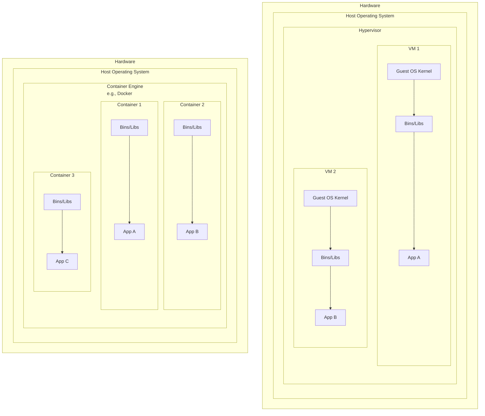

#DevOps #Containerization #Docker #CoreConcept #Virtualization

>  A container is a lightweight, portable "box" for an application. It packages the application's code along with all its dependencies (libraries, runtime, etc.) so it can run reliably and consistently in any environment.

---

## 😫 The Problem: "It Works on My Machine"

Imagine you're developing a web app with three main components: a **React frontend**, a **Python API**, and a **PostgreSQL database**.

> [!danger] The Development Nightmare
> To work on this project, you and every developer on your team would have to manually:
> 1.  Install Node.js, Python, and PostgreSQL.
> 2.  Ensure everyone is using the *exact same versions*.
> 3.  Hope that the versions needed for this project don't conflict with other projects on your machine.
> 4.  Pray that the versions used in development match the versions in the [[CI/CD]] pipeline and in production.
>
> This process is fragile, error-prone, and doesn't scale.

## ✨ The Solution: Containers!

Simply put, containers are **isolated processes** for each of your app's components. The React app, the Python API, and the database each run in their own isolated environment, completely separated from each other and from the host machine.

### Core Characteristics of Containers

✔️ **Self-Contained:** Each container has everything it needs to function (code, runtime, libraries) with no reliance on dependencies pre-installed on the host machine.

✔️ **Isolated:** Since containers run in isolation, they have minimal influence on the host and other containers. This improves security and prevents dependency conflicts.

✔️ **Independent:** Each container is independently managed. You can start, stop, or delete one container without affecting any others.

✔️ **Portable:** A container that runs on your local development machine will work the exact same way in a data center or any cloud environment. **This is the superpower of containers.**

---

## 🏛️ Containers vs. Virtual Machines (VMs)

This is the most important architectural distinction to understand.

-   **Virtual Machines (Heavyweight):** A VM virtualizes the **hardware**, creating an entire, self-contained guest operating system with its own kernel, drivers, and libraries. Spinning up a full VM just to run a single application is a lot of overhead.

-   **Containers (Lightweight):** A container virtualizes the **operating system**. All containers running on a host share the same host OS kernel. They are just isolated processes, making them incredibly fast to start and much more resource-efficient.

---

## 🤝 Using VMs and Containers Together

> [!tip] The Best of Both Worlds
> In modern cloud environments, VMs and containers are often used together. A cloud provider (like AWS or Azure) provisions a **Virtual Machine**. On that VM, you install a container runtime like **[[Docker]]**. You can then run multiple, isolated containerized applications on that single VM, dramatically increasing resource utilization and reducing costs.