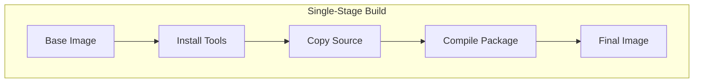
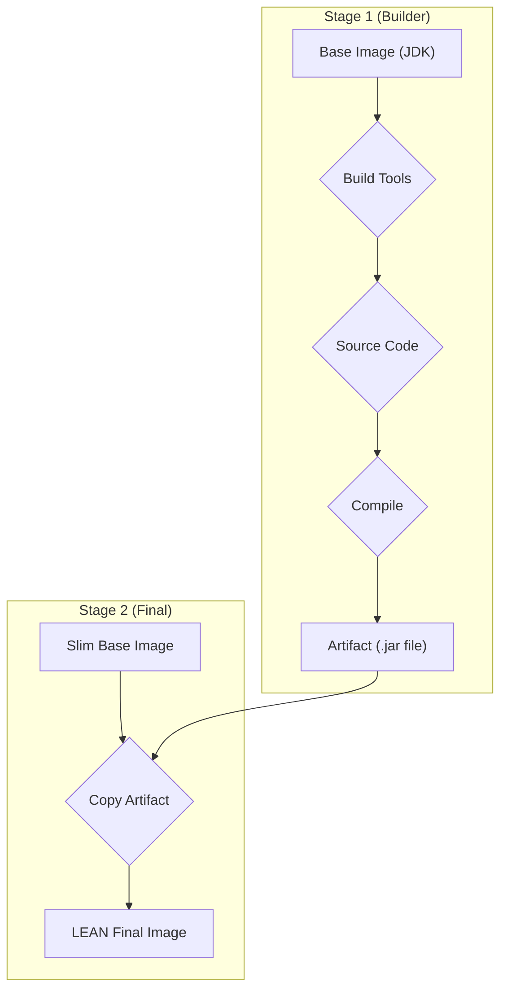

#DevOps #Docker #Performance #BestPractice #ImageBuilding #Security

>  Multi-stage builds use multiple `FROM` statements in one [[Dockerfile]] to create a temporary `builder` image for compiling code, then copy *only the final artifacts* (like a `.jar` file) into a clean, minimal `runtime` image. This results in significantly smaller and more secure final images.

---

## 😫 The Problem with Single-Stage Builds

In a traditional build, all instructions are executed in a single sequence. This means your final image contains not only your application but also all the build-time dependencies (like the full JDK, Maven, compilers, etc.).

> [!danger] The Bloated Image Problem
> This approach leads to bulky images that carry unnecessary weight and increase your security attack surface. A production container has no need for a compiler or a build tool.



## ✨ The Solution: Separate Build and Runtime

Multi-stage builds introduce multiple stages in your `Dockerfile`, each with its own `FROM` instruction and purpose.

This allows you to separate the **build environment** from the final **runtime environment**. This is especially beneficial for compiled languages (Java, Go, Rust) but is also useful for interpreted languages (JS, Python) to minify code and remove development dependencies.

### The Core Syntax
The structure uses two new concepts:
1.  **Multiple `FROM` statements:** Each `FROM` begins a new stage.
2.  **`AS <stage-name>`:** You can name a stage for easy reference.
3.  **`COPY --from=<stage-name>`:** This powerful command copies files *from a previous stage* into the current one.

```dockerfile
# Stage 1: The 'builder' environment
FROM builder-image AS builder
# ... install tools, compile code, create artifact ...

# Stage 2: The clean 'runtime' environment
FROM runtime-image AS final
# Copy ONLY the compiled artifact from the 'builder' stage
COPY --from=builder /path/to/artifact /destination/path
# ... define the final CMD ...
```


---

## 🛠️ Hands-On: Optimizing a Spring Boot App

This guide will walk you through creating a lean, production-ready image for a Java Spring Boot application using a multi-stage build.

### 1. Setup
1.  **Get the App:** Go to **[Spring Initializr](https://start.spring.io/)** with these settings:
    *   Project: Maven
    *   Language: Java
    *   Spring Boot: (A recent version like 3.x)
    *   Java: 21
    *   Dependencies: Add "Spring Web"
2.  Click **GENERATE** to download the ZIP file and extract it.
3.  **Create the "Hello World" Endpoint:** Open `src/main/java/com/example/demo/DemoApplication.java` (your path may vary slightly) and replace its content with:
    ```java
    package com.example.spring_boot_docker;

    import org.springframework.boot.SpringApplication;
    import org.springframework.boot.autoconfigure.SpringBootApplication;
    import org.springframework.web.bind.annotation.RequestMapping;
    import org.springframework.web.bind.annotation.RestController;

    @RestController
    @SpringBootApplication
    public class SpringBootDockerApplication {

        @RequestMapping("/")
            public String home() {
            return "Hello World";
        }

        public static void main(String[] args) {
            SpringApplication.run(SpringBootDockerApplication.class, args);
        }
    }
    ```

### 2. The Single-Stage Build (The "Before")
First, let's build the image the inefficient way to see the problem.

#### Step 2a: Create the Single-Stage Dockerfile
Create a file named `Dockerfile` in the root of your project with the following content:
```dockerfile
# Single-Stage Dockerfile
FROM eclipse-temurin:21-jdk-jammy
WORKDIR /app
COPY .mvn/ .mvn
COPY mvnw pom.xml ./
RUN ./mvnw dependency:go-offline
COPY src ./src
CMD ["./mvnw", "spring-boot:run"]
```

#### Step 2b: Build, Check Size, and Run
```bash
# Build the image
docker build -t spring-helloworld .

# Check the image size
docker images spring-helloworld
```
You'll see an image size of around **~880MB**. It's large because it contains the full JDK and all the Maven build tools.

```bash
# Run the container
docker run -p 8080:8080 spring-helloworld
```
You can now access `http://localhost:8080` and see "Hello World".

### 3. The Multi-Stage Build (The "After")
Now, let's optimize it.

#### Step 3a: Update to a Multi-Stage Dockerfile
Replace the entire content of your `Dockerfile` with the following:
```dockerfile
# Stage 1: The "builder" stage with the full JDK and Maven
FROM eclipse-temurin:21-jdk-jammy AS builder
WORKDIR /opt/app
COPY .mvn/ .mvn
COPY mvnw pom.xml ./
RUN ./mvnw dependency:go-offline
COPY ./src ./src
# Build the application, creating the final .jar file
RUN ./mvnw clean install

# Stage 2: The "final" stage with only the JRE
FROM eclipse-temurin:21-jre-jammy AS final
WORKDIR /opt/app
EXPOSE 8080
# Copy ONLY the compiled .jar file from the 'builder' stage
COPY --from=builder /opt/app/target/*.jar /opt/app/app.jar
# Set the command to run the .jar file
ENTRYPOINT ["java", "-jar", "/opt/app/app.jar"]
```

#### Step 3b: Rebuild and See the Difference
```bash
# Rebuild the image with a new name
docker build -t spring-helloworld-multi-stage .

# Check the image sizes and compare
docker images
```
The output will be stunning:
```
REPOSITORY                    TAG       IMAGE ID       CREATED          SIZE
spring-helloworld-multi-stage latest    c5c76cb815c0   24 minutes ago   428MB
spring-helloworld             latest    ff708d5ee194   About an hour ago  880MB
```
Your final image is now less than half the original size!

> [!tip] Building a Specific Stage
> By default, `docker build` builds the last stage in the file. If you only wanted to build the `builder` stage for debugging, you could use the `--target` flag:
> `docker build --target builder -t my-builder-image .`

---

> [!summary] Key Benefits
> By separating the build and runtime environments, you have created a final image that is:
> -   **Leaner:** Significantly smaller size, leading to faster pulls and deployments.
> -   **More Secure:** The final image has a reduced attack surface because it doesn't contain build tools, compilers, or source code.
> -   **More Efficient:** Follows best practices for creating production-grade container images.