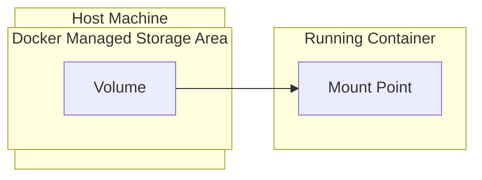

#DevOps #Docker #Storage #CoreConcept #HandsOn

>  Volumes are Docker's mechanism for saving data *outside* of a [[Container|container's]] ephemeral filesystem. By mounting a volume into a container, the data written to that mount point persists even after the container is deleted, allowing you to maintain state for applications like databases.

---

## 😫 The Problem: Ephemeral Containers

When a container starts, it uses the files and configuration from its [[Docker Image]]. The container can create, modify, and delete files in its own writable layer, but this is a temporary sandbox.

> [!danger] Data is Lost on Deletion
> When you delete a container, its entire writable filesystem is destroyed along with it. This is a huge problem for any stateful application, like a database. If you restart a database container, you don't want to start with an empty database every time.

## ✨ The Solution: Volumes

**Volumes** are the preferred mechanism for persisting data generated by and used by Docker containers. They are completely managed by Docker and exist on the host filesystem, outside of any container's lifecycle.

> [!success] The Volume Analogy
> Think of a volume as a dedicated hard drive that you "plug into" your container. The container sees it as a normal directory, but all the data is actually being saved to this external, persistent storage location.

### How It Works Visually



-   When the container writes to `/var/lib/postgresql/data`, it's actually writing to the `postgres_data` volume on the host.
-   When the container is deleted, the `postgres_data` volume and all its data remain untouched.

### Sharing Files with Volumes
You can mount the same volume into multiple containers simultaneously. This is useful for scenarios like:
-   A producer container writing logs or data to a volume.
-   A consumer container (like a log shipper or data processor) reading from the same volume.

---

## ⚙️ Managing Volumes

Volumes have their own lifecycle and can be managed with a set of simple commands.

-   `docker volume create <volume-name>`: Creates a new volume. (Often optional, as Docker can create it on the fly).
-   `docker volume ls`: Lists all volumes on your system.
-   `docker volume rm <volume-name>`: Removes a specific volume. **This will only work if the volume is not currently attached to any container.**
-   `docker volume prune`: A powerful command that removes all "dangling" volumes (any volume not currently attached to at least one container).

---

## 🛠️ Hands-On: Persisting PostgreSQL Data

This guide will walk you through using a volume to persist data for a Postgres container.

### 1. Start Postgres with a Volume
Run a Postgres container. The `-v` flag tells Docker to create (if it doesn't exist) and mount a named volume.

```bash
# -v <volume_name>:<path_inside_container>
docker run --name=db -e POSTGRES_PASSWORD=secret -d -v postgres_data:/var/lib/postgresql/data postgres
```
-   `--name=db`: Names the container `db`.
-   `-e POSTGRES_PASSWORD=secret`: Sets the required password for the database.
-   `-d`: Runs the container in detached (background) mode.
-   `-v postgres_data:/var/lib/postgresql/data`: This is the key part. It mounts the volume named `postgres_data` to the `/var/lib/postgresql/data` directory inside the container, which is where Postgres stores its data files.

### 2. Connect and Add Data
Connect to the running container's `psql` shell.
```bash
docker exec -ti db psql -U postgres
```
Inside the `psql` shell, create a table and insert some data.
```sql
CREATE TABLE tasks (
    id SERIAL PRIMARY KEY,
    description VARCHAR(100)
);
INSERT INTO tasks (description) VALUES ('Finish work'), ('Have fun');
```

### 3. Verify the Data
Run a `SELECT` query to see your data.
```sql
SELECT * FROM tasks;
```
You should see your two records. Now, exit the `psql` shell with `\q`.

### 4. The Critical Test: Destroy the Container
Now, let's prove the data is persisted outside the container. Stop and remove the `db` container completely.
```bash
docker stop db
docker rm db
```
At this point, the container is gone, but the `postgres_data` volume is not.

### 5. Start a New Container with the Same Volume
Start a brand new container, but mount the *exact same volume* to it.
```bash
docker run --name=new-db -d -v postgres_data:/var/lib/postgresql/data postgres
```
> [!tip] No Password Needed
> Notice we didn't need the `POSTGRES_PASSWORD` environment variable this time. The Postgres image only uses that variable to initialize a *new, empty* database. Since we are attaching a volume with an existing database, it skips the initialization step.

### 6. Verify Data Persistence
Connect to the *new* container and check for your data. You can do this in one line.
```bash
docker exec -ti new-db psql -U postgres -c "SELECT * FROM tasks"
```
You will see your original two records, proving that the data was successfully persisted in the volume, completely independent of the container's lifecycle.

---

## 🧹 Cleaning Up

Before you can remove a volume, you must remove any containers attached to it.
```bash
# Force-remove the container (stops it first)
docker rm -f new-db
```
Now you can remove the volume.
```bash
docker volume rm postgres_data
```