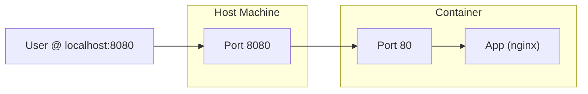

#DevOps #Docker #Networking #CoreConcept

>  Port publishing maps a port on your host machine to a port inside a [[Container]], making the container's application accessible from the outside. The most common command is `docker run -p HOST_PORT:CONTAINER_PORT <image>`.

---

## 😫 The Problem: Isolation is a Double-Edged Sword

[[Container|Containers]] provide isolated processes for each component of your application. This is great for security and dependency management, but it also means you can't access services running inside them directly. A web server running in a container is sandboxed from your host machine's network by default.

## ✨ The Solution: Publishing Ports

**Port publishing** creates a forwarding rule that punches a small, specific hole through the container's network isolation. It tells Docker: "Any traffic that arrives on this specific port on my host machine should be forwarded to this specific port inside the container."

### The Core Syntax (`-p`)
You publish ports when you create a container using the `-p` (or `--publish`) flag with `docker run`.

-   **Syntax:** `docker run -p HOST_PORT:CONTAINER_PORT <image>`
-   **`HOST_PORT`:** The port number on your host machine (your computer).
-   **`CONTAINER_PORT`:** The port number the application is listening on *inside* the container.



**Example:**
To forward traffic from port `8080` on your host to port `80` in an `nginx` container:
```bash
docker run -d -p 8080:80 nginx
```
Now, any traffic sent to `http://localhost:8080` on your host machine will be seamlessly forwarded to port `80` inside the container.

> [!warning] Security Note: Publishes to All Interfaces
> By default, publishing a port makes it accessible on **all network interfaces** (`0.0.0.0`) of your host machine, not just `localhost`. This means if your machine is on a public network, that port could be accessible to others. Be mindful when publishing ports for sensitive services like databases.

---

## Advanced Port Publishing Techniques

### Ephemeral Ports (Letting Docker Choose)
Sometimes you don't care which host port is used, you just want the container's port to be accessible. In this case, you can let Docker pick a random, available ("ephemeral") port on the host.

-   **Syntax:** `docker run -p CONTAINER_PORT <image>` (Omit the `HOST_PORT`)

**Example:**
```bash
docker run -d -p 80 nginx
```
To find out which port Docker assigned, use the `docker ps` command:
```
$ docker ps
CONTAINER ID   IMAGE     COMMAND                  STATUS         PORTS                    NAMES
a527355c9c53   nginx     "/docker-entrypoint.…"   Up 3 seconds   0.0.0.0:54772->80/tcp    romantic_williamson
```
In this example, the application is now accessible on your host at `http://localhost:54772`.

### Publishing All Exposed Ports (`-P`)
The `EXPOSE` instruction in a `[[Dockerfile]]` is metadata that documents which ports an application is intended to use. It does **not** publish the port on its own.

The `-P` (or `--publish-all`) flag tells Docker to read this `EXPOSE` metadata and automatically publish all exposed ports to ephemeral ports on the host.

-   **Syntax:** `docker run -P <image>`

**Example:** The official `nginx` image has `EXPOSE 80` in its Dockerfile.
```bash
docker run -d -P nginx
```
This will automatically map a random host port to the container's port 80.

---

## 🛠️ Hands-On: Publishing Ports

### 1. Using the Docker CLI
Let's run a simple welcome-to-docker application and publish its port.

```bash
docker run -d -p 8080:80 docker/welcome-to-docker
```
-   `-d`: Runs the container in detached mode (in the background).
-   `-p 8080:80`: Maps host port `8080` to container port `80`.

**Verification:**
1.  Open the Docker Desktop Dashboard. You will see the container running and the `8080:80` port mapping listed.
2.  Open your web browser and navigate to `http://localhost:8080`. You will see the welcome page.

### 2. Using Docker Compose
You can define the same port mapping declaratively in a [[Docker Compose]] file.

1.  Create a new directory for your project.
2.  Inside that directory, create a file named `compose.yaml` with the following content:

```yaml
services:
  app:
    image: docker/welcome-to-docker
    ports:
      # Maps HOST_PORT:CONTAINER_PORT
      - "8080:80"
```

3.  In your terminal, navigate to this directory and start the application:
    ```bash
    docker compose up
    ```

**Verification:**
Open your browser and navigate to `http://localhost:8080` to see the same welcome page.