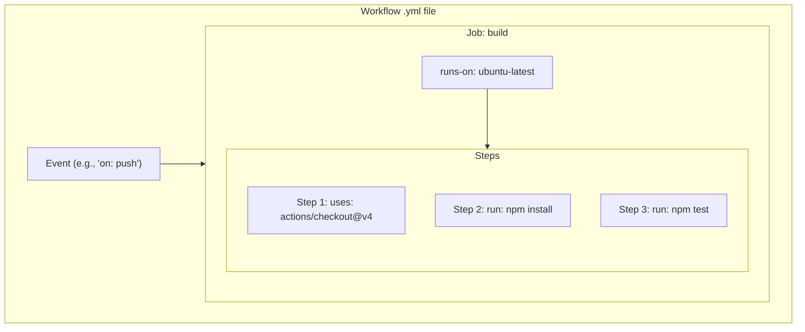

#CI-CD #GitHub #Automation #CoreConcept #Workflow

>  A GitHub Actions file describes a **Workflow** that is triggered by an **Event**. The workflow contains one or more **Jobs**. Each job runs on a runner and contains a sequence of **Steps**. Each step either runs a command or uses a reusable **Action**.

This creates a clear hierarchy:
**Event ➔ Workflow ➔ Job ➔ Step ➔ Action**

---

## 🏛️ Visualizing the Hierarchy

This diagram shows how the components fit together inside a single workflow file.

---

## 🧩 The Components Explained

### 1. Workflow
> A **Workflow** is the top-level automated process that you add to your repository.

-   **Defined in:** A YAML file inside the `.github/workflows/` directory.
-   **Triggered by:** One or more events specified with the `on:` key.
-   **Contains:** At least one job.
-   **Purpose:** To build, test, package, release, or deploy your project.

### 2. Job
> A **Job** is a major section of a workflow that contains a sequence of tasks (steps) and runs on a runner.
-   **Runs on:** A specific machine environment, called a **runner**, defined by the `runs-on:` key (e.g., `ubuntu-latest`).
-   **Execution:** Jobs within a workflow run in parallel by default, but can be configured to depend on each other.
-   **Contains:** A list of `steps`.

### 3. Step
> A **Step** is an individual task that can run commands or an action within a job.
-   **The smallest unit:** A step is the most granular part of a job's execution.
-   **Executed:** Sequentially within a job.
-   **Two forms:** A step can either:
    1.  Execute a shell command directly using the `run:` key.
    2.  Use a pre-packaged, reusable action with the `uses:` key.

### 4. Action
> An **Action** is a reusable, standalone command or script that performs a specific, well-defined task.
-   **The building blocks:** Actions are the core reusable components of the GitHub Actions ecosystem.
-   **Sources:** They can be:
    -   Official or community-created actions from the GitHub Marketplace (e.g., `actions/checkout@v4`).
    -   Custom actions you create within your own repository (e.g., `uses: ./path/to/my-action`).
-   **Invoked by:** The `uses:` key within a step.