#CI-CD #DevOps #CoreConcept #Automation #Workflow

>  **CI** automates building and testing code. **Continuous Delivery** adds the step of automatically packaging that code into a release. **Continuous Deployment** takes the final step and automatically deploys that release to production.

---

## The Three Stages of Modern Software Automation

Continuous Integration, Continuous Delivery, and Continuous Deployment are three distinct but sequentially related practices that form the backbone of modern DevOps. They represent a progression of increasing automation in the software development lifecycle.

```mermaid
graph TD
    subgraph Legend
        direction LR
        L1[🤖 Automated Process]
        L2[🙋‍ Manual Step]
    end

    A[Code Commit] --> B(Build & Test);
    subgraph CI [Continuous Integration]
        B
    end

    B --> C(Package & Publish);
    subgraph CDelivery [Continuous Delivery]
        C
    end
    
    C --> D{Approve Deployment?};
    D -->|✅ Yes| E[Deploy to Production];
    D -->|❌ No| F[Stop];
    
    subgraph CDeployment [Continuous Deployment]
        E
    end

    style C fill:#e6f3ff,stroke:#0066cc
    style D fill:#fff3cd,stroke:#856404
    style E fill:#d4edda,stroke:#155724
    
    C -.->|"✅ Production-Ready Artifact"| D;

```

---

### 1. 🤖 Continuous Integration (CI)

> [!info] Definition
> **Continuous Integration (CI)** is a practice where developers integrate tested code into a shared branch several times per day.

This is the foundational stage of the pipeline. Every time a developer commits a change, an automated process kicks off to ensure the new code doesn't break anything.

-   **What it involves:**
    -   Developers frequently push code to a shared repository (e.g., on GitHub).
    -   An automated system (like [[GitHub Actions]]) detects the push.
    -   The system automatically builds the application.
    -   It then runs a suite of automated tests (unit tests, integration tests, etc.).
    -   The developer is notified immediately if the build or tests fail.

-   **The Main Goal:** To find and fix bugs early and often, improving code quality and development velocity.

---

### 2. ✅ Continuous Delivery (CD)

> [!info] Definition
> **Continuous Delivery (CD)** is the next phase after CI, where the process also ensures that the successfully tested code is automatically packaged into a release and stored in an artifact repository.

This stage takes the output of a successful CI run and prepares it for deployment. The key result of this stage is a **production-ready artifact**.

-   **What it involves:**
    -   Everything in [[#1 🤖 Continuous Integration CI|Continuous Integration]].
    -   After all tests pass, the pipeline automatically packages the application. This could mean creating a [[Docker Image]], a Java `.jar` file, or a `.zip` archive.
    -   This packaged artifact is then automatically published to a secure, centralized storage location, known as an artifact repository (e.g., [[GitHub Packages]], Docker Hub, Artifactory).

-   **The Main Goal:** To ensure that every validated change results in an artifact that is **proven to work and is ready to be deployed to production at any time**. The actual deployment to production is typically a manual, one-click step.

---

### 3. 🚀 Continuous Deployment (CD)

> [!info] Definition
> **Continuous Deployment (CD)** takes Continuous Delivery to the next level by automatically deploying every validated release directly to production without any human intervention.

This is the final stage of full automation. If the code passes all the automated checks in the CI and Continuous Delivery stages, it is considered safe and is immediately released to users.

-   **What it involves:**
    -   Everything in [[#2 ✅ Continuous Delivery CD|Continuous Delivery]].
    -   After the production-ready artifact is successfully published, the pipeline automatically triggers a deployment script.
    -   The new version of the application is deployed to the production environment (e.g., [[How do I use GitHub Actions to deploy to Azure?|Azure]], AWS, on-premises servers).

-   **The Main Goal:** To reduce the lead time—the time between a developer writing a line of code and that code being available to users—to the absolute minimum. This allows for rapid feedback and fast delivery of value.