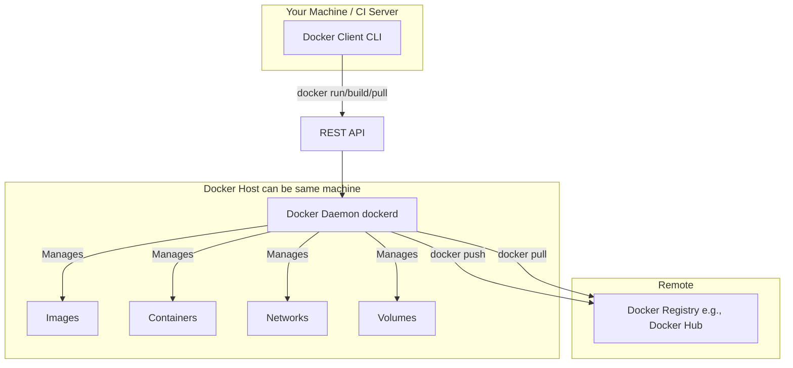

#DevOps #Containerization #Docker #CoreConcept

>  Docker is a platform for building, shipping, and running applications inside lightweight, isolated environments called **[[Containers]]**. It packages an application and all its dependencies together, ensuring it works consistently everywhere.

---

## ❓ What is Docker?

Docker is an open platform that enables you to separate your applications from your infrastructure. By taking advantage of Docker's methodologies for shipping, testing, and deploying code, you can significantly reduce the delay between writing code and running it in production.

> [!info] The Core Idea: Containers
> Docker provides the ability to package and run an application in a **[[Container]]**. A container is lightweight, portable, and contains everything an application needs to run: code, runtime, system tools, and libraries. This isolation ensures that the application runs the same regardless of where it is deployed.

The platform is designed to manage the entire lifecycle of your containers:
1.  **Develop** your application and its components inside containers.
2.  **Distribute & Test** your application using the container as the single unit of deployment.
3.  **Deploy** your application to production as a container or an orchestrated service ([[Kubernetes]]).

---

## 🎯 Why Use Docker? The Core Benefits

✔️ **Fast, Consistent Delivery of Applications**
Docker streamlines the [[CI/CD]] pipeline. Developers work in standardized local environments that mirror production. When a bug is found, it can be fixed and redeployed consistently, as the container encapsulates the entire environment.

✔️ **Responsive Deployment & Scaling**
Containers are extremely portable. They can run on a developer's laptop, a data center VM, or a cloud provider with no changes. This makes it easy to dynamically manage workloads, scaling services up or down in near real-time to meet demand.

✔️ **Running More Workloads on the Same Hardware**
Docker is lightweight and fast. It provides a viable, cost-effective alternative to hypervisor-based [[Virtual Machines]], allowing you to run many more containers on a single host. This leads to much higher server density and better resource utilization.

---

## 🏛️ The Docker Architecture (Client-Server)

Docker uses a client-server architecture. The **Docker Client** talks to the **Docker Daemon**, which does the heavy lifting of building, running, and distributing your Docker containers via a [[REST API]].



### ⚙️ The Docker Daemon (`dockerd`)
The Docker daemon is a persistent background process that listens for Docker API requests. It manages all the core Docker objects: [[Docker Image|images]], [[Container|containers]], networks, and volumes.

### 💻 The Docker Client (`docker`)
The client is the primary command-line interface (CLI) for interacting with Docker. When you type a command like `docker run`, the client sends the instruction to the `dockerd`. A client can communicate with a local or a remote daemon.

### ☁️ Docker Registries
A Docker registry is a storage system for [[Docker Image|Docker images]].
- **[[Docker Hub]]** is the default public registry.
- You can also host your own private registry for internal company images.
When you `docker pull` an image, Docker fetches it from the configured registry. When you `docker push`, it sends it to the registry.

---

## 🧱 Fundamental Docker Objects

### 📚 Images
> An **image** is a read-only template with instructions for creating a Docker container.

An image is built from a `[[Dockerfile]]`, which defines a series of steps (layers). Each instruction creates a new layer in the image. This layered filesystem is what makes images so lightweight and fast, as only the layers that have changed need to be rebuilt. You can create your own images or use public ones from [[Docker Hub]].

### 🏃‍ Containers
> A **container** is a runnable instance of an image.

A container is defined by its image plus any configuration options you provide at runtime. It is isolated from other containers and the host machine by default. When a container is removed, any changes made to its filesystem that aren't stored in persistent storage ([[Volumes]]) are lost.

---

## 🚀 A Practical Example: `docker run`

The following command runs a container from the `ubuntu` image, attaches it to your terminal interactively, and starts a `bash` shell.

```bash
docker run -it ubuntu /bin/bash
```

Here's what happens step-by-step:
1.  **Check for Image:** Docker checks if you have the `ubuntu:latest` image locally.
2.  **Pull Image:** If it's not found locally, Docker pulls the image from the default registry ([[Docker Hub]]), as if you had run `docker pull ubuntu`.
3.  **Create Container:** Docker creates a new container from that image.
4.  **Allocate Filesystem:** Docker allocates a read-write filesystem layer on top of the read-only image layers. This allows you to create or modify files inside the running container.
5.  **Create Network Interface:** Docker connects the container to the default network, assigning it an IP address.
6.  **Start and Execute:** Docker starts the container and executes the specified command (`/bin/bash`). Because you used the `-i` (interactive) and `-t` (tty) flags, your terminal is now connected to the container's shell.
7.  **Stop Container:** When you type `exit`, the `bash` process terminates, and the container stops. It is not removed and can be started again.