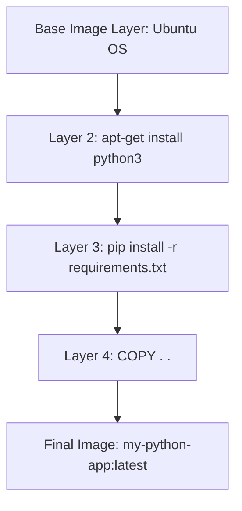

#DevOps #Containerization #Docker #CoreConcept

>  An **image** is a read-only, layered template used to create a [[Container]]. It's the immutable blueprint that packages an application's code, runtime, and all its dependencies.

---

## ❓ Where Does a Container Get its Files?

Seeing as a [[Container]] is just an isolated process, where does it get its files and configuration? How do you share those environments?

> [!success] The Answer: Container Images
> A **container image** is a standardized, self-contained package that includes all the files, binaries, libraries, and configurations needed to run a container.
> 
> - For a **PostgreSQL image**, that package contains the database binaries and default config files.
> - For a **Python web app image**, it includes the Python runtime, your app code, and all of its dependencies (`requirements.txt`).

---

## 🏛️ The Two Core Principles of Images

### 1. 🧊 Immutability
Once an image is created, it **cannot be changed**. If you need to make a modification (like updating a dependency), you create a *new image* with the change applied as a new layer. This guarantees consistency and prevents configuration drift.

### 2. 겹 Layers
An image is composed of a series of stacked, read-only layers. Each layer represents a file system change (e.g., adding a file, installing a program).

> This layered approach is what makes building images so efficient. When you rebuild an image, Docker only rebuilds the layers that have changed, leveraging a cache for the unchanged ones. This is why a small code change can result in a near-instantaneous build.

#### Visualizing the Layers
When you build a Python app image, you start from a base image and add your own layers on top.

*This allows you to focus on your app, rather than the underlying setup of Python itself.*

---

## ☁️ Finding and Using Images: Docker Hub

[[Docker Hub]] is the default global marketplace for storing and distributing images. It has hundreds of thousands of images created by developers and organizations that you can download and run locally.

### Docker Trusted Content
[[Docker Hub]] provides a variety of Docker-supported and endorsed images, which are great, secure starting points.

-   **✅ Docker Official Images:** A curated set of highly secure and well-maintained repositories (e.g., `python`, `node`, `postgres`). They serve as the starting point for the vast majority of users.
-   **🤝 Docker Verified Publishers:** High-quality images from commercial publishers that have been verified by Docker (e.g., images from Microsoft, Oracle, etc.).
-   **📦 Docker-Sponsored Open Source:** Images published and maintained by open-source projects sponsored by Docker.

### Ready-to-Go vs. Base Images

> [!tip] Two Main Ways to Use Images
> 1.  **Ready-to-Go Images:** Services like `redis` or `memcached` are popular Docker Official Images that are ready to run instantly, with no configuration required.
> 2.  **Base Images:** Images like `node` or `python` are designed to be used as a starting point (a foundation) for your own applications. You use them in a `[[Dockerfile]]` to add your own code and configurations on top.