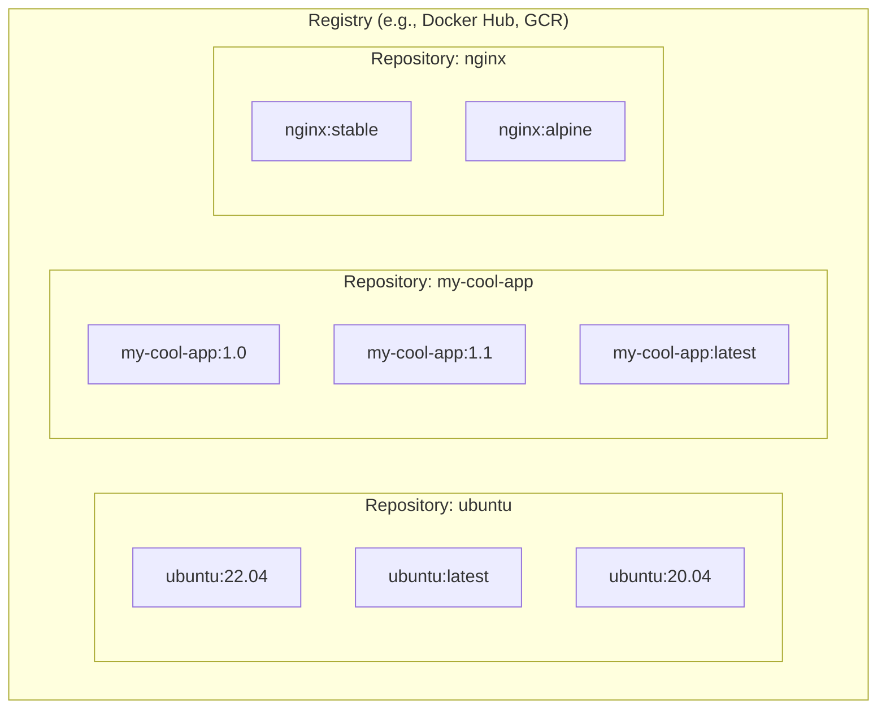

#DevOps #Docker #CoreConcept #Registry

>  A **registry** is a server that stores and distributes [[Docker Image|images]] (like Docker Hub). A **repository** is a specific collection of related images within that registry, often for a single application (like the official `ubuntu` repository or `your-username/my-app`).

---

## ❓ Why Do We Need a Registry?

Now that you know what a [[Docker Image]] is, you might wonder where you store them.

You can store images on your local computer, but what if you want to share them with your team or deploy them to a server?

> [!success] The Solution: An Image Registry
> An **image registry** is a centralized, server-side application for storing and distributing your container images. It acts as a library for all your images, making them accessible from anywhere.

### Public vs. Private Registries

-   **🌍 Public Registries:** Open to everyone. [[Docker Hub]] is the default public registry that the Docker client is configured to use out of the box.
-   **🔒 Private Registries:** Used to store proprietary, company-specific images. Common options include:
    -   **Cloud Providers:** Amazon ECR, Azure ACR, Google GCR.
    -   **Self-Hosted:** Harbor, JFrog Artifactory, GitLab Container Registry.

---

## ⚠️ Registry vs. Repository: The Key Distinction

While related, these two terms are not interchangeable. Getting this right is key to understanding Docker image naming.

> -   **Registry:** The entire storage system. The server.
> -   **Repository:** A specific "folder" or collection of related images within that registry.

> [!tip] A Simple Analogy
> Think of it like GitHub:
> - The **Registry** is `github.com` itself.
> - A **Repository** is a specific project, like `torvalds/linux` or `your-username/your-project`.

### Visualizing the Relationship

The following diagram shows how a single registry can contain many repositories, each holding multiple tagged images.

---

## 🏷️ Image Naming Convention

This registry/repository structure is directly reflected in how you name and tag your images.

The full format for an image name is:

`[registry-hostname/][username/][repository-name]:[tag]`

- **`ubuntu:latest`**
    - `registry-hostname`: *Omitted*, so it defaults to [[Docker Hub]].
    - `username`: *Omitted*, as it's an official image.
    - `repository-name`: `ubuntu`.
    - `tag`: `latest`.

- **`my-username/my-app:1.0.2`**
    - `registry-hostname`: Defaults to [[Docker Hub]].
    - `username`: `my-username`.
    - `repository-name`: `my-app`.
    - `tag`: `1.0.2`.

- **`gcr.io/my-google-project/my-api:v2`**
    - `registry-hostname`: `gcr.io` (Google Container Registry).
    - `username`: `my-google-project`.
    - `repository-name`: `my-api`.
    - `tag`: `v2`.

> [!note] Docker Hub Free Tier
> The free tier of Docker Hub allows you to create one private repository and unlimited public repositories.