#DevOps #Docker #Orchestration #CoreConcept

>  Docker Compose is a tool for defining and running multi-container Docker applications. You use a single YAML file (`docker-compose.yml`) to configure all your application's services, networks, and volumes, then create and start them with a single command.

---

## 😫 The Problem: Juggling Multiple Containers

If you've been working with single [[Container|containers]], you've mastered the basics. But modern applications are more complex. They often require a database, a message queue, a cache, and other services.

> [!danger] The Anti-Pattern: The Monolithic Container
> One best practice for containers is that **each container should do one thing and do it well**. Avoid the tendency to install a database, a web server, and your app all in a single container. This violates the principle of isolation and creates a complex, hard-to-manage artifact.

The alternative is to run multiple `docker run` commands. But you'll soon face a new set of problems:
-   Manually creating and managing Docker networks so containers can communicate.
-   Remembering and typing out long, complex `docker run` commands with all the necessary flags.
-   A complicated and error-prone cleanup process.

## ✨ The Solution: Docker Compose

Docker Compose is the standard tool for managing local multi-container environments.

> [!success] The Compose Approach
> With Docker Compose, you define all of your containers (which Compose calls **services**) and their configurations in a single YAML file, typically named `docker-compose.yml`.
> 
> If you include this file in your code repository, anyone who clones your project can get the entire application stack up and running with a single command: `docker compose up`.

### Declarative by Nature

It's important to understand that Compose is a **declarative tool**. You define the *desired state* of your application in the YAML file, and Compose figures out how to make it happen.

-   You don't need to recreate everything from scratch every time.
-   If you make a change to your `docker-compose.yml` file (e.g., change a port or an environment variable), you just run `docker compose up` again. Compose will intelligently reconcile the changes and only update the containers that need it.

---

## 🏛️ Dockerfile vs. Compose File: The Critical Difference

This is a fundamental concept that new users often confuse. They serve two completely different purposes.

```mermaid
flowchart TD
    subgraph A [Build Time]
        DF[📄 Dockerfile] -- defines instructions --> Build{docker build}
        Build --> Image[📦 Docker Image]
    end

    subgraph B [Run Time]
        CF[📝 docker-compose.yml] -- defines services --> Run{docker compose up}
        Run -- uses --> Image
        Run --> C1[🏃‍ Container 1: Web App]
        Run --> C2[🏃‍ Container 2: Database]
        Run --> C3[🏃‍ Container 3: Redis Cache]
        C1 <--> C2
        C1 <--> C3
    end

    Image -- is the blueprint for --> C1
```



> -   **`Dockerfile`:** The blueprint for building a **single** [[Docker Image]]. It contains the step-by-step instructions (`FROM`, `COPY`, `RUN`, etc.).
> -   **`docker-compose.yml`:** The orchestration plan for running a **multi-container application**. It defines which images to use, how to network them together, and what ports to expose. It often references a `Dockerfile` to build a custom image for one of its services.

---

### 📝 A Simple Example (`docker-compose.yml`)

Here's how you might define a simple web application with a PostgreSQL database.

```yaml
# Specifies the Compose file version. '3.8' is a good modern choice.
version: '3.8'

# All containers are defined as 'services'
services:
  # The name of our first service: the web application
  webapp:
    # Build the image from the Dockerfile in the current directory
    build: .
    # Map port 5000 on the host to port 5000 in the container
    ports:
      - "5000:5000"
    # Set environment variables for the webapp container
    environment:
      - DATABASE_URL=postgresql://user:password@db:5432/mydatabase
    # This service depends on the 'db' service. It will wait for 'db' to start.
    depends_on:
      - db

  # The name of our second service: the database
  db:
    # Use the official postgres image from Docker Hub, version 13
    image: postgres:13
    # Persist database data on the host machine using a volume
    volumes:
      - postgres_data:/var/lib/postgresql/data/
    # Set environment variables required by the postgres image
    environment:
      - POSTGRES_DB=mydatabase
      - POSTGRES_USER=user
      - POSTGRES_PASSWORD=password

# Define the named volume used by the 'db' service
volumes:
  postgres_data:
```