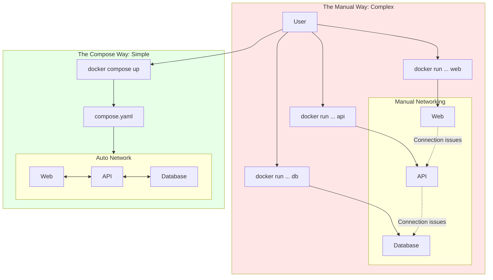

#DevOps #Docker #Orchestration #CoreConcept #BestPractice

>  [[Docker Compose]] lets you define and run a complete multi-container application (like a web app, API, and database) from a single YAML file, solving the chaos of managing multiple, complex `docker run` commands.

---

## 😫 The Problem: The Limits of a Single Container

Starting a single-container application is easy. But as applications grow, managing them as individual containers becomes difficult.

Imagine a simple Python script. Soon, it needs to connect to a database. Then, it needs user authentication. If you add all of these services into a single container, you violate a core best practice.

> [!danger] The Monolithic Container Anti-Pattern
> One of the most important best practices for containers is that **each container should do one thing and do it well**. Avoid the tendency to have one container do multiple things. This creates a bloated, insecure, and hard-to-manage artifact.

The correct approach is to run each service—the frontend, the backend API, the database—in its own separate container. But this leads to a new question: "How do I connect and manage them all?"

## ⚠️ The Manual (and Painful) Alternative

While `docker run` is a convenient tool for launching a single container, it quickly becomes unmanageable for a full application stack.

> [!danger] The Chaos of Multiple `docker run` Commands
> -   **Manual Command Hell:** You have to write and maintain long, complex `docker run` commands for each service, with different flags for development, testing, and production. This is tedious and extremely error-prone.
> -   **Fragile Networking & Dependencies:** You have to manually create networks and start containers in the correct order to ensure they can communicate. This becomes a nightmare as the application grows.
> -   **Difficult Scaling:** Scaling an individual service is difficult. You can't just "add another API container" easily.
> -   **Scattered Data Management:** Persisting data requires managing separate volume mounts for each `docker run` command, leading to a disorganized setup.
> -   **Tedious Configuration:** Setting environment variables for each service through separate `-e` flags is repetitive and easy to get wrong.

## ✨ The Solution: Docker Compose

Docker Compose is the definitive tool for orchestrating multi-container applications in local development. It replaces the chaos with a single, declarative configuration file.

> [!success] The Declarative Approach with `compose.yaml`
> Docker Compose allows you to define your entire multi-container application in a single YAML file (e.g., `compose.yaml`). This file specifies all your services, their dependencies, environment variables, volumes, and networks.
> 
> With this single file, you get:
> ✔️ **Centralized Configuration:** No more multiple `docker run` commands. Your entire application stack is defined in one place.
> ✔️ **Automatic Networking:** Compose creates a dedicated network for your application, allowing services to discover and communicate with each other using their service names.
> ✔️ **Simple Scaling:** You can scale individual services up or down with a single command (e.g., `docker compose up --scale api=3`).
> ✔️ **Easy Data Persistence:** Volumes are defined cleanly within the Compose file, keeping your data management strategy organized.
> ✔️ **Effortless Configuration:** Set environment variables for all your services in one place, making your setup clean and repeatable.

### Visualizing the Difference

---

> [!summary] Conclusion
> By leveraging Docker Compose, you can build complex applications with modularity, scalability, and consistency at their core. It is the essential tool for moving beyond single containers and managing a complete application stack in a simple, repeatable, and version-controllable way.