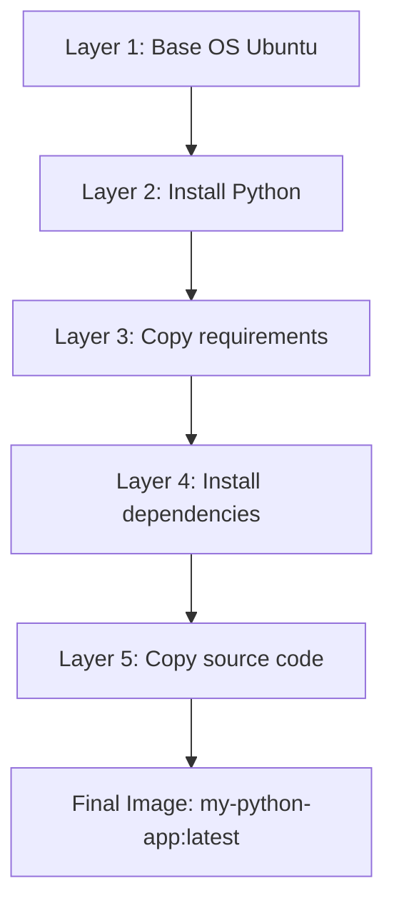
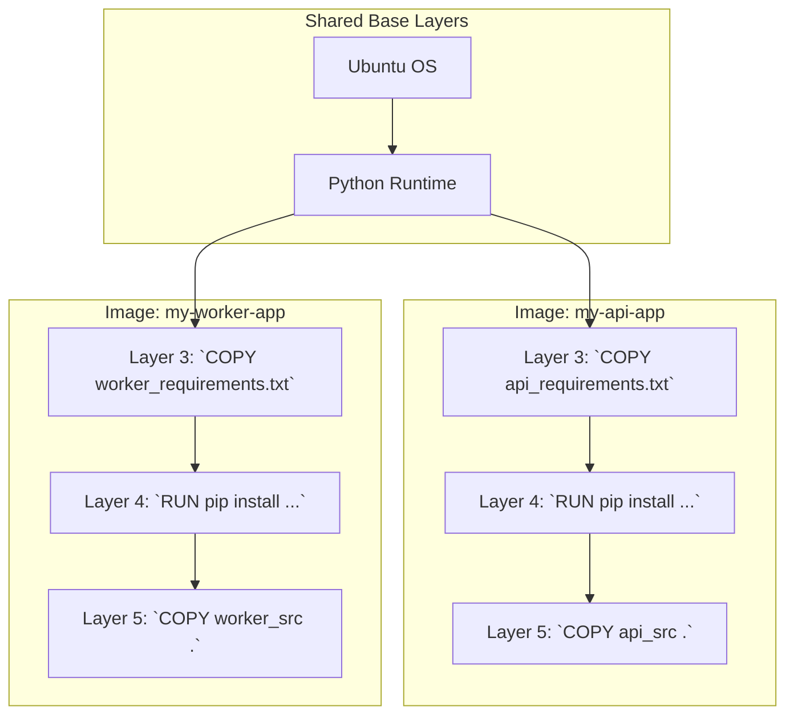
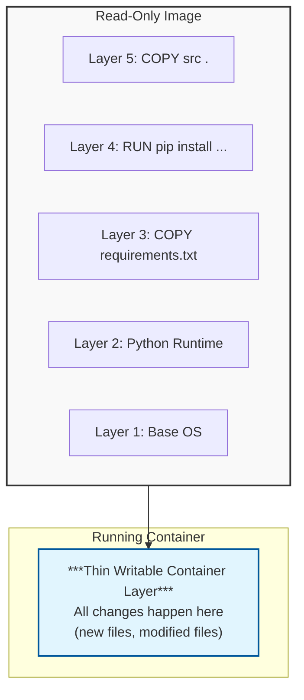

#DevOps #Docker #CoreConcept #FileSystem

>  A [[Docker Image]] is a stack of read-only layers. When you run a [[Container]], Docker adds a thin, **writable layer** on top. All changes made inside the container (like creating or modifying files) are written to this top layer, leaving the original image immutable and pristine.

---

As you learned in [[Docker Image]], container images are composed of immutable layers. But what does that actually mean, and how are those layers used to create the filesystem a container can use?

## The Layered Filesystem in Action

Each layer in an image represents a set of filesystem changes—additions, deletions, or modifications. Each instruction in a `[[Dockerfile]]` creates a new layer.

Let’s look at a theoretical image for a Python application:
1.  **Layer 1:** A base OS with basic commands (`ubuntu`).
2.  **Layer 2:** Installs the Python runtime.
3.  **Layer 3:** Copies the `requirements.txt` file.
4.  **Layer 4:** Installs the Python dependencies via `pip`.
5.  **Layer 5:** Copies the application's source code.

This layering can be visualized as a stack:

---

## ✨ The Power of Reusability

This layered architecture is incredibly beneficial because it allows layers to be reused between different images.

> [!success] The Benefit
> Imagine you have two different Python applications. Because of layering, they can both leverage the exact same base layers for the OS and the Python runtime. Docker only needs to store and build the unique layers for each application.
>
> This makes builds **faster**, and reduces the amount of **storage** and **network bandwidth** required to distribute the images.

*Both `my-api-app` and `my-worker-app` share the first two layers, saving significant space and build time.*

---

## ⚙️ How It Works Under the Hood: The Union Filesystem

Layering is made possible by two key technologies: **content-addressable storage** and **union filesystems**. Here's a simplified explanation of how it works when you run a container:

1.  **Extraction:** As Docker pulls an image, each layer is extracted into its own directory on the host filesystem.
2.  **Stacking:** When you run a container from the image, Docker uses a **union filesystem** to create a unified view by stacking these layers on top of each other.
3.  **The Writable Layer:** Crucially, Docker adds one final, thin, **writable layer** on top of the read-only image layers. This layer is unique to the specific running container.

When the container starts, its root directory is set to this unified stack. Any changes the container makes—creating a new file, modifying an existing one, deleting one—are written to this top writable layer. The original image layers remain untouched.

### Visualizing the Stack

> [!tip] The Key Takeaway
> This "copy-on-write" mechanism is what allows you to run multiple containers from the same underlying image. Each container gets its own unique writable layer, but they all share the same read-only base layers, making them incredibly efficient and isolated.