#DevOps #Docker #Storage #CoreConcept #Development

>  A **bind mount** creates a direct, real-time link between a specific file or directory on your host machine and a path inside a [[Container]]. It's the primary tool for mounting source code into a container during development, allowing instant code changes without rebuilding the image.

---

## 😫 The Problem: Accessing Host Data

[[Container|Containers]] are isolated by design. This is great for security and preventing dependency conflicts, but it means they can't access files on your host machine by default.

> [!danger] Common Challenges
> - **Development:** How can you edit source code on your host with your favorite IDE and have the changes instantly reflected inside a running container?
> - **Configuration:** How do you provide a container with a configuration file (e.g., `settings.json`, `.env`) that lives on your host, especially if it contains secrets you don't want to bake into the image?

## ✨ The Solution: Volumes vs. Bind Mounts

Docker offers two primary ways to mount external data into a container. They serve different purposes.

> [!info] **[[Docker Volumes]]** (For Persisting Data)
> - **Managed by:** Docker.
> - **Location:** A dedicated, Docker-managed area on the host filesystem. You don't usually care about the exact path.
> - **Primary Use Case:** **Persisting data** that the container *generates*, like a database's data files. The data should outlive the container.

> [!tip] **Bind Mounts** (For Linking Host Files)
> - **Managed by:** You, the user.
> - **Location:** A **specific, absolute path** on your host machine that you define.
> - **Primary Use Case:** **Development and providing external files**. You mount your project's source code or a specific config file from your host directly into the container.

### How a Bind Mount Works Visually

A bind mount is a direct portal between your host's filesystem and the container's filesystem.

```mermaid
graph TD
    subgraph Host Machine
        HostPath["📁 /Users/dev/my-project/src"]
    end

    subgraph RunningContainer["🏃‍ Running Container"]
        ContainerPath["📁 /app"]
    end

    HostPath -- Direct Filesystem Link --> ContainerPath
```


*Changes made in `/Users/dev/my-project/src` on the host are immediately visible inside the container at `/app`, and vice-versa (unless it's read-only).*

---

## ⚙️ Syntax and Usage

You can create a bind mount using either the `-v` or `--mount` flag.

### The `-v` Flag (Simple Syntax)
This is the original, more concise syntax.
- **Syntax:** `docker run -v /path/on/host:/path/in/container <image>`
- **Behavior:** If `/path/on/host` does not exist, Docker will automatically create it as a directory.

**Example:**
```bash
docker run -d -v /Users/me/my-app/src:/app nginx
```

### The `--mount` Flag (Recommended Syntax)
This is the more verbose but explicit and powerful syntax.
- **Syntax:** `docker run --mount type=bind,source=/path/on/host,target=/path/in/container <image>`
- **Behavior:** If the `source` path does not exist on the host, Docker will **not** create it and will instead throw an error. This is safer as it prevents typos from creating unwanted directories.

**Example:**
```bash
docker run -d --mount type=bind,source=/Users/me/my-app/src,target=/app nginx
```

> [!best-practice] Prefer `--mount`
> Docker recommends using the `--mount` syntax. It is more explicit, making your commands easier to read, and its stricter error handling helps prevent mistakes.

---

## 🔒 File Permissions: Read-Only Mounts

By default, a bind mount is **read-write**, meaning the container can modify the files on your host. For security and to prevent accidental changes, it's often best to mount files as **read-only**.

- **`-v` Syntax:** Append `:ro` to the end.
  ```bash
  docker run -d -v /path/to/config.json:/etc/config.json:ro my-app
  ```
- **`--mount` Syntax:** Add the `readonly` option.
  ```bash
  docker run -d --mount type=bind,source=/path/to/config.json,target=/etc/config.json,readonly my-app
  ```
> [!security] Always Use Read-Only When Possible
> Granting write access to your host filesystem from a container should be done with caution. For things like configuration files or even source code (if your container doesn't need to write back to it), always use a read-only mount.

---

> [!tip] Performance Note: Synchronized File Shares
> For very large codebases on Docker Desktop (Mac/Windows), traditional bind mounts can sometimes be slow. Modern versions of Docker Desktop use optimized file-sharing technologies (like VirtioFS) to improve performance, making the development experience much smoother.